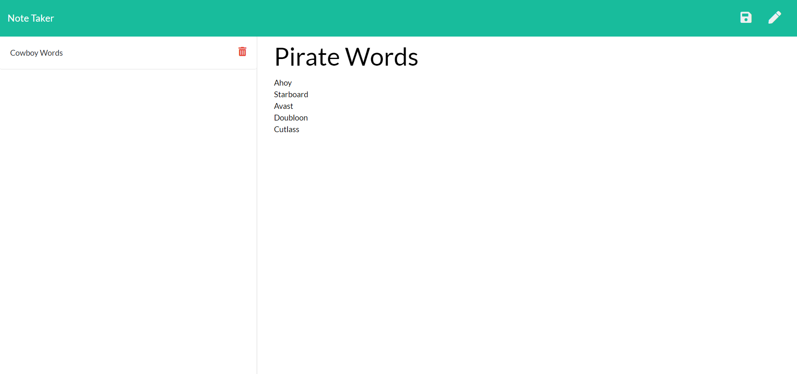

# Note-Taker
A simple note-taking app that allows the user to create and save notes using an Express.js back end to save and retrieve note data from a JSON file. The front-end of this site was provided for the sake of building a back end connection and deploying the app to Heroku.
  
  
  
  ***
  
  ## Table of Contents
  * [Description](#Description)
  * [Installation](#Installation)
  * [Usage](#Usage)
  * [Testing](#tests)
  * [Contributions](#contributions)
  * [License](#license)
  * [Questions](#Questions)
  
  
  ## **Installation**
  
  Installing this app will require express and fs using  npm install.
  
  ***
  
  ## **Usage**
  
  This app will allow you to write, edit, save, and delete notes and messages
  
  ***
  
  ## **Contributions**
  
  No guidelines or restrictions
  
  ***
  
  ## **Tests**
  
  No tests available
  
  ***
  
  ## **License**
  
  
  
  
  
  ***
  
  ## **Questions**
  
  
  [GitHub](https://www.github.com/undefined)
  
  
  Questions? Email me at: austin.ruhf@gmail.com
